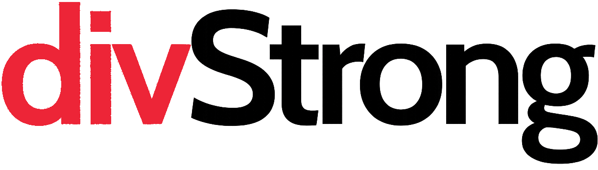

<p align="center">
  
</p>

<h1 align="center">DivStrong</h1>

<p align="center">
  A custom TALL stack SaaS platform built to help a software development agency manage clients, prospects, proposals, and payments — all in one place.
</p>

---

## About

DivStrong is an internal business management tool purpose-built for a custom software development company. Rather than stitching together a handful of third-party tools, DivStrong consolidates the core workflows of running an agency into a single, streamlined application:

- **Client Management** — Maintain a centralized directory of clients and prospects with contact details, company info, and internal notes.
- **Proposal Builder** — Create polished, professional proposals with reusable scope-of-work templates, itemized cost breakdowns, and milestone-based payment schedules.
- **Digital Signatures** — Clients can review and sign proposals directly in the browser — no third-party e-signature service required.
- **Proposal Tracking** — Know exactly when a proposal is viewed, accepted, or declined, with automatic email notifications at every stage.
- **Service & Scope Libraries** — Build a catalog of reusable services and scope items to speed up proposal creation and keep pricing consistent.
- **Admin Dashboard** — A full-featured back office powered by Filament for managing every aspect of the business.

## Tech Stack

| Layer        | Technology               |
| ------------ | ------------------------ |
| **T**ailwind | Tailwind CSS 4           |
| **A**lpine   | Alpine.js (via Livewire) |
| **L**aravel  | Laravel 12               |
| **L**ivewire | Livewire 4               |
| Admin Panel  | Filament 5               |
| Build Tool   | Vite 7                   |
| PHP          | 8.2+                     |

## Getting Started

### Prerequisites

- PHP 8.2+
- Composer
- Node.js & npm
- A supported database (MySQL, PostgreSQL, or SQLite)

### Installation

```bash
# Clone the repository
git clone <repo-url> divstrong
cd divstrong

# Install PHP dependencies
composer install

# Install front-end dependencies
npm install

# Configure environment
cp .env.example .env
php artisan key:generate

# Run migrations
php artisan migrate

# Seed an admin user (if applicable)
php artisan db:seed

# Build front-end assets
npm run build
```

### Development

```bash
# Start the Laravel dev server and Vite in parallel
npm run dev
```

The admin panel is available at `/admin`.

## License

This is proprietary software. All rights reserved.
